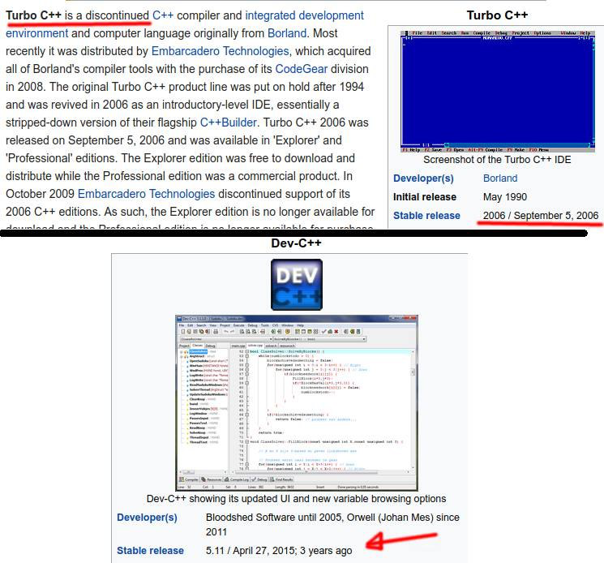

# It's me again.
# I appeal to you - be ambicious! Why do I say so? Because I see very bad trends in this group.

1. When someone is asking for good IDE many people advice Dev-C++. Stop it! It is discontinued, obsolete. If you use it, and consider yourself as an ambicious person, switch to another IDE and forget Dev-C++.

2. When someone is asking about good compiler many people advice Turbo C++. Again - stop it. Last release of this discontinued compiler is from 12 years ago! It doesn't support even C++11. So why using it? Not to mention people that thinks that Dev-C++ or Code::Blocks is a compiler.

3. Some people says "he's just a begginer". Is it really a reason to use obsolete tools? No, it isn't! On the contrary - use the newest and best tools from the beginning!

4. Also I advice to learn only from sources, where at least C++11 standard is explained. If Dev-C++ or Turbo C++ is used in some tutorial, find another. That will help you in the future when you will be searching for a job. Most employers alredy requires C++11 or C++14. Being curious about new standards like C++17 and C++20 is also a good symptom ;)

# What toolchain can I suggest?
```c
On Windows: Visual Studio 2017 or QtCreator with g++(minGW) (both are free)
On Linux or Mac: QtCreator with g++ or clang compiler (also free)
Of course there are also other great possibilities like CLion, Eclipse, NetBeans, KDevelop or even Code::Blocks.
```

Some people may accuse me to trying to be smarter than God in this post. Belive me, I am not. I am just sad that many people here are not ambicious at all and using archaic toolchain.



